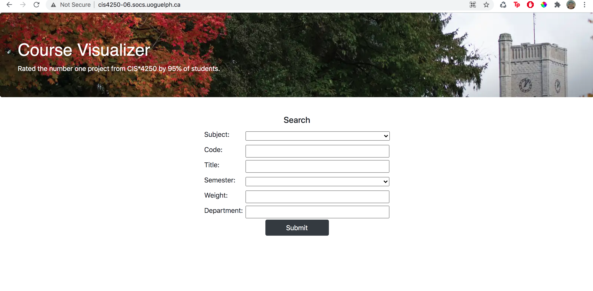
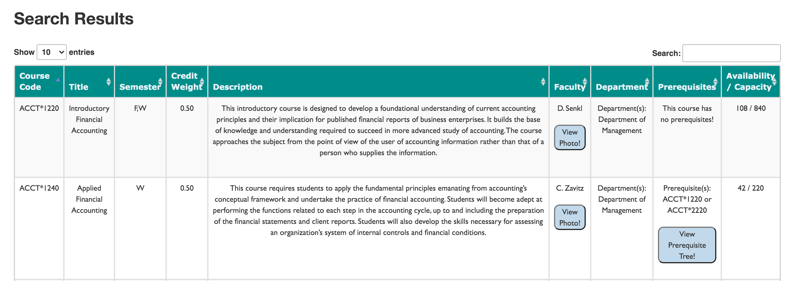
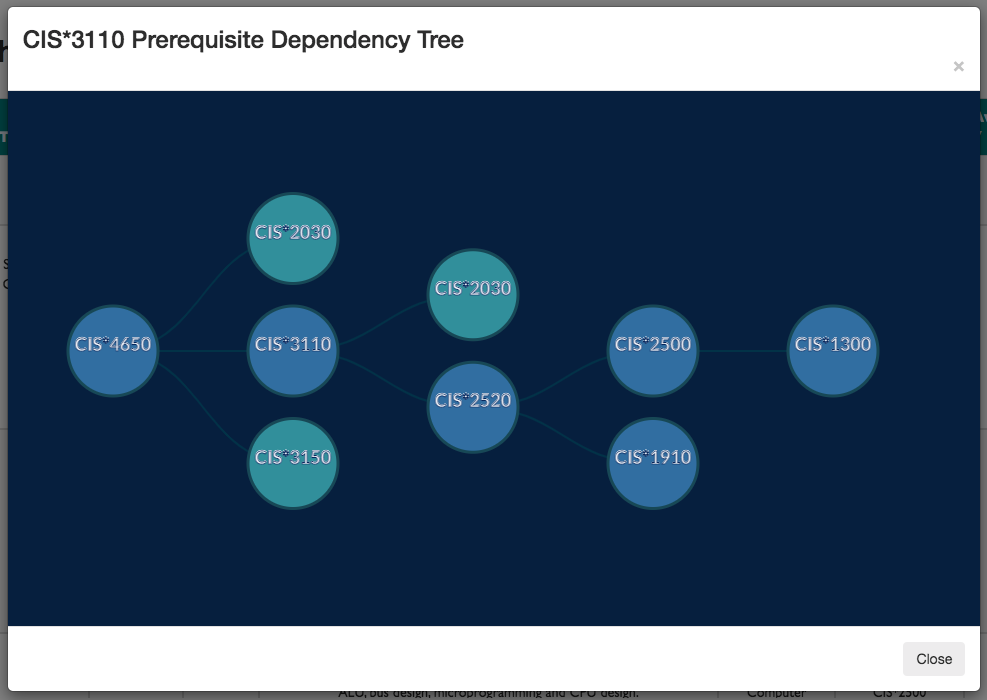
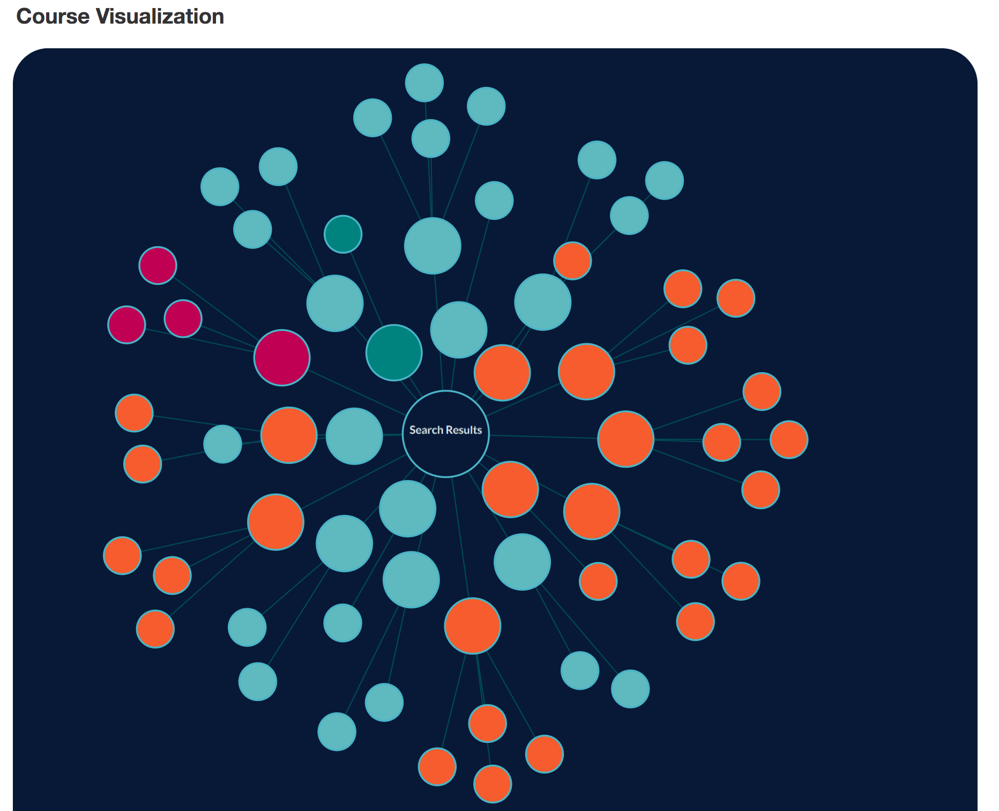

# Electron README

## Set up
In order to set up the Electron app:
1. Clone this repo && `cd src/electronapp/course-finder`
2. Make sure Node.js is installed
3. Run `npm install`
4. Run `npm start`
The Electron app should open showing our Search page!

## Run Linter
1. run 'ngx standard [filename.js] --fix'

## Search
Each field below is optional!
On Submit, search query is posted to the API and if response is successful, results page is loaded.



## Results
Matching courses are displayed in a table with pagination and filtering. Click on a row to zoom in on that course in teh graph.



## Faculty Images
By clicking on the "View Photo" button in the "Faculty" column for any course, the user can see a photo of the Professor currently teaching it. This image is pulled from the Bing Image Search API so it might not always be 100% accurate.


## Prerequisite Tree Diagrams
By clicking on the "View Prerequisite Tree" button in the "Prerequisites" column for any course, the user can see a tree diagram showing ALL the prerequisites for that course. The tree layout produces node-link diagrams of trees using the Reingold–Tilford “tidy” algorithm.



The data to produce this graph looks like this:
```
{ 
      "id": "CIS*3110",
      "children": [
        { 
          "id": "CIS*2030",
          "children": [
            { "id": "CIS*1910" },
            {
              "id": "CIS*2500",
              "children": [
                { "id": "CIS*1300" }
              ]
            }
          ]    
        },
        {
          "id": "CIS*2520",
          "children": [
            {
              "id": "CIS*2500",
              "children": [
                { "id": "CIS*1300" }
              ]
            },
            {"id": "CIS*1910"}
          ]    
        }
      ]
    }
}
```


## Results Graph
Matching courses are then graphed in a d3.js Force Directed Tree Graph. This type of graph combines the d3.js force-directed layout with hierarchy link structure to produce a set of nodes grouped into prerequisite trees. This graph implements a velocity Verlet numerical integrator for simulating physical forces on particles.



The data to produce this graph looks like this:
```
{
    "name": "Search Results",
    "size": 2,
    "children": [
        {
            "name": "CIS*2030",
            "size": 2,
            "children": [
                {
                    "name": "CIS*1910",
                    "size": 0
                },
                {
                    "name": "CIS*2500",
                    "size": 0
                }
            ]
        },
        {
            "name": "CIS*2170",
            "size": 3,
            "children": [
                {
                    "name": "CIS*1200",
                    "size": 0
                },
                {
                    "name": "CIS*1300",
                    "size": 0
                },
                {
                    "name": "CIS*1500",
                    "size": 0
                }
            ]
        }
    ]
}
```
